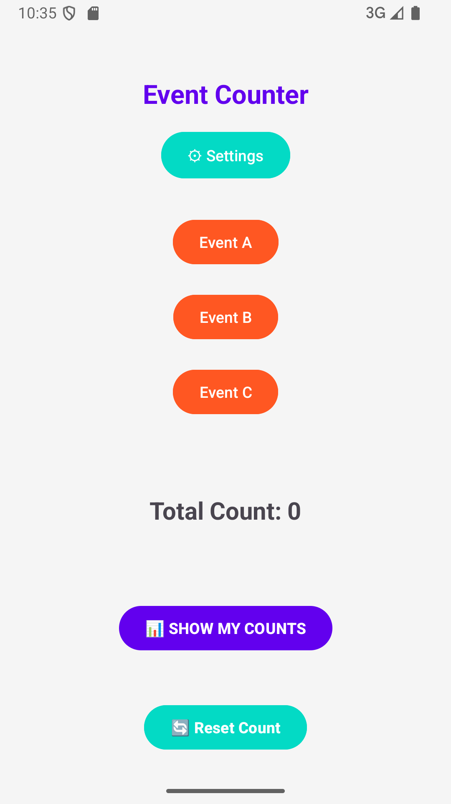
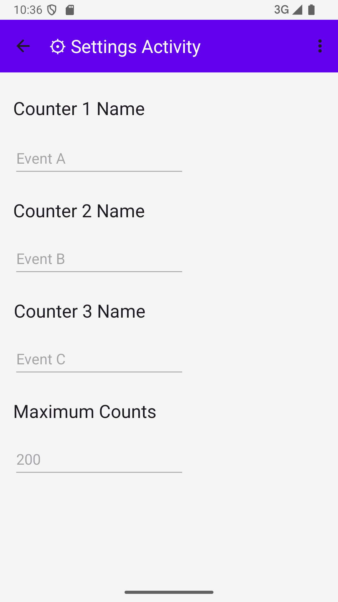
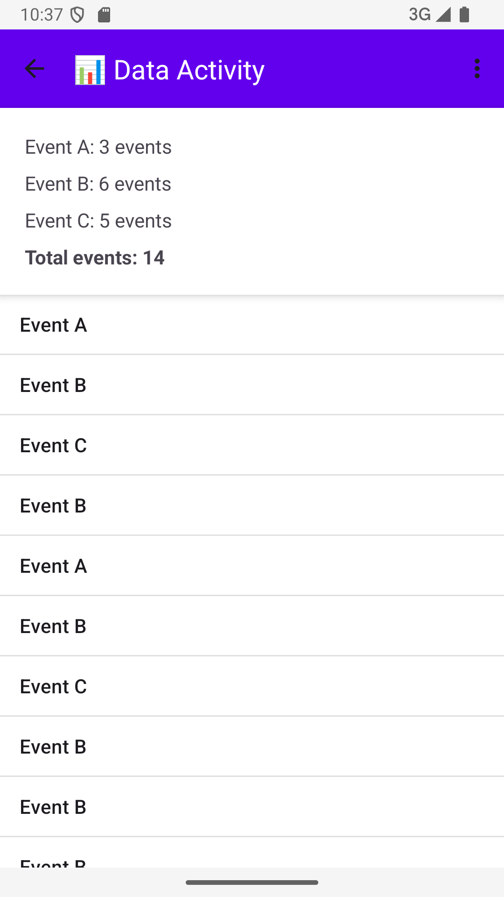

# Event Counter App 🚀  

## 📌 Overview  
This is an **Android application** that allows users to track events using counters. Users can customize event names, set a maximum count limit, and view event history in a scrollable list. The app follows the **Model-View-Controller (MVC) architecture** and stores data persistently using **SharedPreferences**.

---

## 🏗️ Features  
✅ **Event Counting** – Tap a button to increase event count.  
✅ **Customizable Counters** – Users can rename event buttons.  
✅ **Maximum Count Limit** – Restricts event count as per user preference.  
✅ **Event History** – Displays a **chronological list** of events.  
✅ **Toggle Mode** – Switch between **event names and numeric representation (1,2,3)**.  
✅ **Reset Functionality** – Allows users to reset event count for testing.  
✅ **Persistent Data** – Saves settings and event history using **SharedPreferences**.  
✅ **MVC Architecture** – Clean separation of **Model, View, and Controller**.  

---

## 🏗️ Architecture (MVC)  
📂 **Model:** `CounterModel.java`  
Manages data, handles **SharedPreferences**, and stores event history.  

📂 **View:** `activity_main.xml`, `activity_settings.xml`, `activity_data.xml`  
Defines **UI layout** for event tracking, settings, and data viewing.  

📂 **Controller:** `MainActivity.java`, `SettingsActivity.java`, `DataActivity.java`  
Handles **user interactions**, updates the UI, and communicates with the model.  

---

## 🎨 UI Screenshots  
| Main Activity | Settings Activity | Data Activity |
|--------------|----------------|--------------|
|  |  |  |

---

## 📜 Installation & Setup  
1️⃣ **Clone the Repository**  
```bash
git clone https://github.com/yourusername/Event-Counter-App.git
```

2️⃣ Open in Android Studio
- Open the cloned project in Android Studio
- Sync Gradle and install dependencies

3️⃣ Run the App

Click ▶️ Run to launch the app on an emulator or a real android device.

---

## 🎯 Usage Guide
**📌 Main Screen**
Tap on Event Buttons to increase the event count.
Press Show My Counts to view event history.
Press Reset Count to reset counters (useful for testing).

**📌 Settings**
Change event button names.
Set the maximum event count.
Press Save to update settings.

**📌 Data Activity**
View a scrollable list of past events.
Toggle between Event Names & Numeric Counters (1,2,3).

## 🛠️ Technologies Used
- Java – Primary language for Android development.
- Android SDK – Core framework for app development.
- SharedPreferences – Persistent storage of user data.
- ConstraintLayout – Responsive UI layout.
